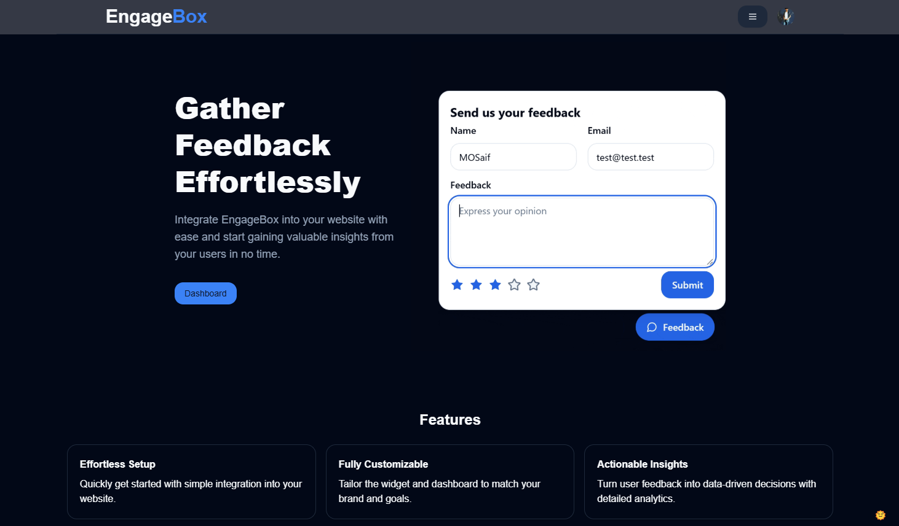
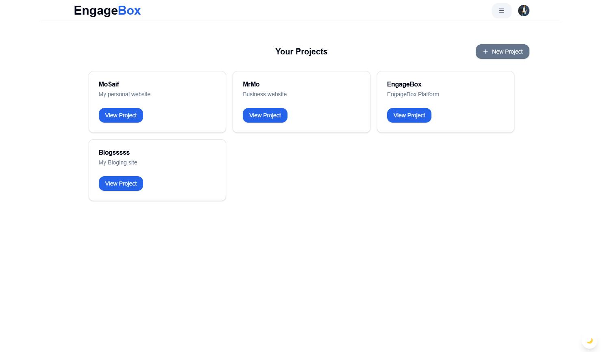

# EngageBox Dashboard

A powerful dashboard application for managing user feedback collection projects. Built with Next.js and modern web technologies.

## ✨ [Related Widget](https://github.com/MoSaif00/EngageBox-Widget.git)

## ✨ [App Demo](https://engage-box.vercel.app/)





## Prerequisites

Before you begin, ensure you have:

- Node.js (v16 or higher)
- npm or yarn package manager
- Clerk account
- Stripe account
- Supabase project

## Environment Setup

1. Clone the repository:

```bash
git clone https://github.com/MoSaif00/EngageBox-Dashboard.git
cd engagebox-dashboard
```

2. Create a `.env` file in the root directory with the following variables:

```env
NEXT_PUBLIC_CLERK_PUBLISHABLE_KEY=<Public API key for Clerk>
CLERK_SECRET_KEY=<Secret API key for Clerk>
DATABASE_URL=<Connection string for the database>
WIDGET_URL=<Domain where the widget is deployed>
NEXT_PUBLIC_STRIPE_PUBLISHABLE_KEY=<Public API key for Stripe>
STRIPE_SECRET_KEY=<Secret API key for Stripe>
STRIPE_WEBHOOK_SECRET=<Secret key for Stripe webhook verification>
STRIPE_WEBHOOK_LOCAL_SECRET=<Secret key for local Stripe webhook verification>
NEXT_PUBLIC_BASE_URL=<Website Domain here>
```

3. Install dependencies:

```bash
npm install
```

4. Set up the database:

```bash
npm run db:generate  # Generate database client
npm run db:migrate  # Run migrations
npm run db:push     # Push schema changes
```

5. Start the development server:

```bash
npm run dev
```

## Database Management

The application uses DrizzleORM with PostgreSQL. Key commands:

- `npm run db:generate`: Generate database client
- `npm run db:migrate`: Run database migrations
- `npm run db:push`: Push schema changes to database

## Tech Stack

- **Frontend**: Next.js, React, TailwindCSS, shadcn/ui
- **Authentication**: Clerk
- **Database**: PostgreSQL with DrizzleORM
- **Payments**: Stripe
- **Backend Services**: Supabase
- **Styling**: TailwindCSS

## Deployment

The application can be deployed to any platform that supports Next.js applications (Vercel, Netlify, etc.).

1. Configure environment variables on your hosting platform
2. Connect your repository
3. Deploy the application
