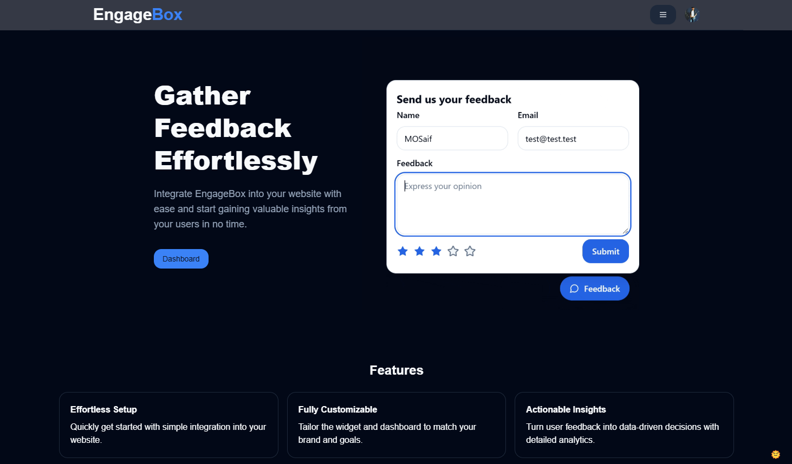
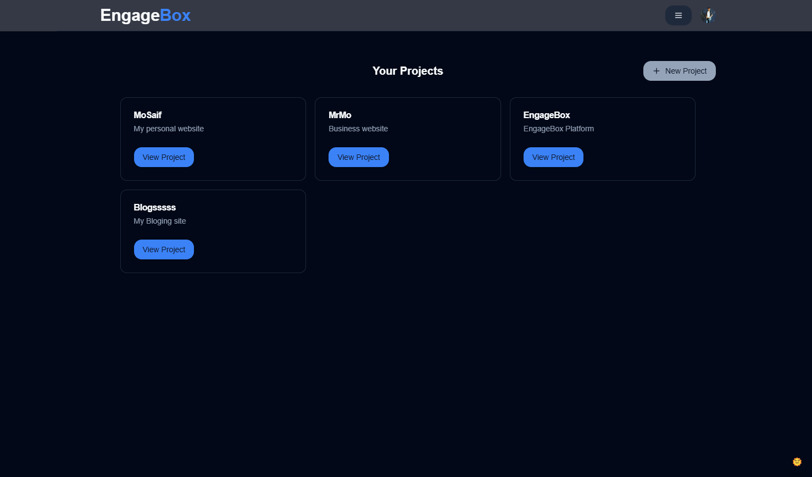

# EngageBox Dashboard

A powerful dashboard application for managing user feedback collection projects. Built with Next.js and modern web technologies.

## ✨ [Related Widget](https://github.com/MoSaif00/EngageBox-Widget.git)

## ✨ [App Demo](https://engage-box.vercel.app/)





## Prerequisites

Before you begin, ensure you have:

- Node.js (v16 or higher)
- npm or yarn package manager
- Clerk account
- Stripe account
- Supabase project

## Environment Setup

1. Clone the repository:

```bash
git clone https://github.com/MoSaif00/EngageBox-Dashboard.git
cd engagebox-dashboard
```

2. Create a `.env.local` file (see `.env.example`) with:

```env
NEXT_PUBLIC_CLERK_PUBLISHABLE_KEY=pk_live_...   # pk_test_ only for local/dev
CLERK_SECRET_KEY=sk_live_...
DATABASE_URL=<Supabase Transaction pooler URI, port 6543>
WIDGET_URL=<Domain where the widget is deployed>
NEXT_PUBLIC_PUBLISHABLE_KEY=<Stripe publishable key>
STRIPE_SECRET_KEY=<Stripe secret key>
STRIPE_WEBHOOK_SECRET=<Stripe webhook secret>
STRIPE_WEBHOOK_LOCAL_SECRET=<Local Stripe webhook secret>
NEXT_PUBLIC_BASE_URL=<Dashboard URL, e.g. https://engage-box.vercel.app>
```

### Production checklist (Clerk + Vercel)

Because `*.vercel.app` cannot use Clerk DNS/CNAME, Clerk uses a **proxy** on your app:

1. Clerk Dashboard → Domains should show proxy URL: `https://engage-box.vercel.app/__clerk`
2. In Vercel Production env vars set:
   - `NEXT_PUBLIC_CLERK_PUBLISHABLE_KEY` = `pk_live_...`
   - `CLERK_SECRET_KEY` = `sk_live_...`
   - `NEXT_PUBLIC_CLERK_PROXY_URL` = `https://engage-box.vercel.app/__clerk`
   - `NEXT_PUBLIC_CLERK_SIGN_IN_URL` = `/sign-in`
   - `NEXT_PUBLIC_CLERK_SIGN_UP_URL` = `/sign-up`
   - `NEXT_PUBLIC_CLERK_SIGN_IN_FALLBACK_REDIRECT_URL` = `/dashboard`
   - `NEXT_PUBLIC_CLERK_SIGN_UP_FALLBACK_REDIRECT_URL` = `/dashboard`
3. Deploy this app (middleware proxies `/__clerk/*`, auth lives at `/sign-in` + `/sign-up`)
4. **Account Portal:** In Clerk → Account Portal, do **not** use `accounts.engage-box.vercel.app` (it cannot work on vercel.app). Prefer **Clerk’s accounts.dev domain**, or rely on in-app `/sign-in` and `/sign-up` pages.
5. Back in Clerk Domains, click **Verify** until the domain is verified
6. Do **not** set `NEXT_PUBLIC_CLERK_PROXY_URL` for local `pk_test_` development

For full branded Account Portal later, add a real custom domain you own (not `vercel.app`).

3. Install dependencies:

```bash
npm install
```

4. Set up the database:

```bash
npm run db:generate  # Generate database client
npm run db:migrate  # Run migrations
npm run db:push     # Push schema changes
```

5. Start the development server:

```bash
npm run dev
```

## Database Management

The application uses DrizzleORM with PostgreSQL. Key commands:

- `npm run db:generate`: Generate database client
- `npm run db:migrate`: Run database migrations
- `npm run db:push`: Push schema changes to database

## Tech Stack

- **Frontend**: Next.js, React, TailwindCSS, shadcn/ui
- **Authentication**: Clerk
- **Database**: PostgreSQL with DrizzleORM
- **Payments**: Stripe
- **Backend Services**: Supabase
- **Styling**: TailwindCSS

## Deployment

The application can be deployed to any platform that supports Next.js applications (Vercel, Netlify, etc.).

1. Configure environment variables on your hosting platform
2. Connect your repository
3. Deploy the application
